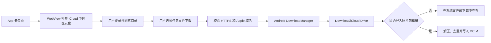
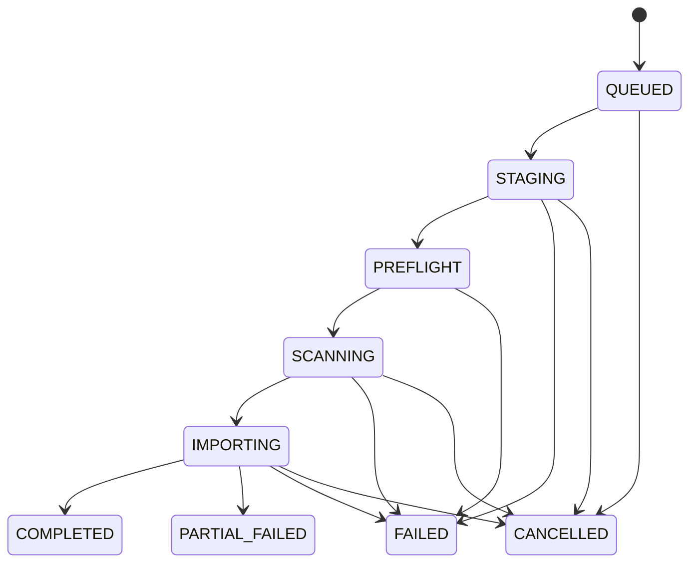

# iCloud 中国区云盘下载助手：开发设计文档

> 文档状态：云盘浏览与下载 MVP 开发基线<br>
> 最后更新：2026-08-21<br>
> 适用范围：Android 客户端第一版

## 1. 项目概述

本项目是一款面向中国大陆 Apple 账户的 Android 端 iCloud 云盘网页浏览与下载助手。

用户在 App 内嵌的中国区官方 `https://www.icloud.com.cn/iclouddrive/` 页面中完成登录、隐私声明确认和双重认证，随后查看整个 iCloud 云盘并下载用户选择的文件。文件按原格式保存到 Android 公共目录 `Download/iCloud Drive/`。原有照片/视频解压、去重和写入系统相册能力保留为下载后的可选操作。中国大陆 iCloud 由云上贵州运营。

产品定位必须使用“云盘网页下载助手”或“文件下载助手”，不得宣传为实时同步、自动同步、原生 iCloud API 客户端或官方 iCloud Android 客户端。

## 2. 目标与边界

### 2.1 MVP 目标

- 在 App 内安全加载 iCloud 中国区官方云盘网页。
- 由用户在官方网页中完成登录和双重认证。
- 查看用户整个 iCloud 云盘中的文件和文件夹。
- 下载文档、压缩包、照片、视频等任意文件类型。
- 将原始文件保存到公共目录 `Download/iCloud Drive/`。
- 使用 Android 系统下载服务提供后台下载、通知和失败恢复。
- 为导航和下载 URL 执行 HTTPS 与 Apple 域名白名单检查。
- 允许用户清除 WebView Cookie 和站点数据。
- 可选将下载的照片、视频或 ZIP 导入 `DCIM/iCloud Photos/`。

### 2.2 MVP 不包含

- App 内输入、保存或转发 Apple 账户密码、验证码、Cookie。
- 调用非公开 iCloud Drive 或 iCloud Photos 接口。
- 在 WebView 中注入 JavaScript、模拟点击或抓取网页 DOM。
- 后台检测 iCloud 云端新增或删除内容。
- Android 与 iCloud 双向删除。
- 自动删除用户下载的原始文件或 ZIP。
- 云端备份、跨设备同步、多账户同时登录。
- 对 HEIC/H.265/RAW 进行强制转码。
- 将 Live Photo 合成为 Android 专有动态照片格式。

## 3. 核心用户流程



标准操作步骤：

1. 用户打开 App 的“云盘”页面。
2. App 在受限 WebView 中加载 `https://www.icloud.com.cn/iclouddrive/`。
3. 用户在官方页面完成隐私声明确认、登录和双重认证。
4. 用户浏览文件夹并选择任意文件下载。
5. App 检查下载链接必须为 HTTPS 且属于受信任的 Apple/iCloud 内容域名。
6. App 把当前会话 Cookie、User-Agent 和来源地址交给 Android `DownloadManager`。
7. 系统下载服务把文件保存到 `Download/iCloud Drive/` 并显示通知。
8. 用户可在系统“文件”“下载”或 App 的下载入口查看文件。
9. 如果下载内容是照片、视频或 ZIP，用户可选择进入“导入”页写入系统相册。

说明：云盘文件列表、目录操作和下载按钮均由 Apple 官方网页提供，App 不解析 DOM，也不调用非公开服务接口。Apple 没有向 Android 第三方 App 提供访问用户整个 iCloud Drive 的公开原生 API；CloudKit 和 iCloud 文档容器只允许 App 访问自身容器，不能用于列出用户整个云盘。

## 4. 技术基线

| 项目 | 决策 |
| --- | --- |
| 开发语言 | Kotlin |
| UI | Jetpack Compose + Material 3 |
| 架构 | MVVM + 单向数据流 |
| 异步模型 | Kotlin Coroutines + Flow |
| 本地数据库 | Room |
| 设置存储 | DataStore |
| 依赖注入 | Hilt |
| 网页入口 | Android WebView，限制顶层导航域名 |
| 通用文件下载 | Android `DownloadManager` |
| 文件输入 | Storage Access Framework |
| 媒体输出 | MediaStore |
| 后台任务 | WorkManager `CoroutineWorker`，大任务前台通知 |
| 最低系统 | Android 10，`minSdk = 29` |
| 编译/目标版本 | `compileSdk = 36`，`targetSdk = 36` |
| Java 工具链 | 使用当前 Android Gradle Plugin 支持的稳定 JDK，并在 Gradle 中锁定 |

从 2026 年 8 月 31 日起，Google Play 新应用和更新需要以 Android 16（API 36）或更高版本为目标，因此本项目直接以 API 36 为基线。依赖版本统一放入 `gradle/libs.versions.toml`，只使用稳定版并提交锁定结果，不在本文硬编码容易过期的库版本。

## 5. 总体架构

MVP 阶段使用单 `app` Gradle 模块，按职责划分 Kotlin 包。暂不引入多 Gradle 模块，以减少构建复杂度；当功能扩展到云端中转、多账户或格式转换后再拆分模块。

建议目录：

```text
app/src/main/java/<package>/
├── app/                 # Application、导航、依赖注入
├── core/
│   ├── web/             # WebView 会话、域名校验、系统下载调度
│   ├── database/        # Room、DAO、迁移
│   ├── files/           # SAF、暂存、空间检测
│   ├── hashing/         # SHA-256
│   ├── media/           # MIME、元数据、MediaStore
│   ├── security/        # ZIP 校验、日志脱敏
│   └── worker/          # 导入任务调度
├── feature/
│   ├── drive/           # 内嵌云盘页面和浏览器控制栏
│   ├── importer/
│   ├── history/
│   └── settings/
└── domain/              # 用例、模型、错误定义
```

### 5.1 分层职责

- UI 层：承载受限 WebView、展示下载入口和可选照片导入状态。
- Web 层：限制导航与下载域名、传递当前会话、调度系统下载服务。
- Domain 层：定义创建照片导入批次、取消导入、清理缓存等可选用例。
- Data 层：Room、DataStore、ContentResolver、DownloadManager、MediaStore 和文件系统实现。
- Worker 层：执行可恢复的照片导入任务，持续更新数据库进度。

UI 只订阅数据库和 Worker 状态。不要依赖 Activity 内存状态保存导入进度。

## 6. 网页与登录设计

### 6.1 打开方式

在 App 页面内使用 Android `WebView` 加载固定地址：

```text
https://www.icloud.com.cn/iclouddrive/
```

启用 JavaScript、DOM Storage、Cookie 和第三方 Cookie，以满足 Apple 登录与云盘网页运行要求；禁用文件访问、内容 URI 访问、混合内容和多窗口，并保持 Android Safe Browsing 开启。Release 构建禁止启用 WebView 调试。

顶层导航只允许 HTTPS，并允许 `.icloud.com.cn`、Apple 登录域名和 iCloud 登录沙箱域名。非白名单链接交给系统浏览器，不在 WebView 内加载。本项目不自动降级到国际区 `www.icloud.com`。

### 6.2 安全边界

- App 不声明或实现 Apple 登录表单。
- App 只发起中国区官方云盘域名，登录、隐私声明确认和双重认证均由官方网页处理。
- App 不注入 JavaScript、不解析 DOM、不记录输入框内容。
- App 不判断用户是否成功登录。
- App 不保存 Apple 账户、电话号码、密码或验证码。
- WebView 在本机保存 Cookie；下载时只把目标 URL 可用的 Cookie 作为请求头交给系统下载服务。
- 设置页必须提供“清除 iCloud 登录数据”，删除 Cookie 和 Web Storage。
- App 需要 `INTERNET` 权限加载官方网页并下载文件。

### 6.3 浏览器兼容性

至少验证 Android System WebView 的当前稳定版和项目支持的最低版本，并覆盖三星、小米、OPPO、vivo 等厂商设备。重点检查登录、双重认证、页面缩放、返回栈、下载回调和 WebView 进程异常恢复。

## 7. 云盘下载与保存位置

### 7.1 下载触发

WebView 的 `DownloadListener` 接收用户在官方网页主动触发的下载。开始下载前必须校验：

- URL scheme 必须为 `https`；
- 主机必须是 `.icloud.com.cn`、`.icloud-content.com.cn`、`.icloud-content.com`、`.apple-cloudkit.com`、`.apzones.com`、`.cdn-apple.com` 或 `.apple.com` 的精确域或子域；
- `evilicloud.com.cn`、`icloud.com.cn.example.com` 等相似域名必须拒绝；
- `blob:`、`data:`、`file:` 和明文 HTTP 不交给系统下载服务；
- 文件名必须移除路径分隔符、控制字符和 Android/Windows 保留字符。

下载请求携带当前 URL 对应的 Cookie、WebView User-Agent 和中国区云盘 Referer，由 Android `DownloadManager` 执行后台传输和通知。

### 7.2 默认保存位置

所有云盘文件保持原格式，默认保存到：

```text
Download/iCloud Drive/
```

选择公共 Downloads 而不是 DCIM 的原因：

- iCloud 云盘包含 PDF、Office 文档、压缩包、项目文件等非媒体内容；
- 用户可通过系统“文件”和“下载”统一查找、打开、分享或删除；
- 文件不会因卸载 App 而随 App 私有目录一起消失；
- 避免把非照片文件错误写入图库；
- 保留下载文件的原始名称、扩展名和内容。

同名文件不覆盖，按 `name (2).ext`、`name (3).ext` 递增。DownloadManager 负责网络切换、通知和系统级失败状态。

### 7.3 可选照片导入

照片、视频和照片 ZIP 下载后仍位于 `Download/iCloud Drive/`。只有用户主动进入“导入”页并通过系统文件选择器选择内容时，App 才执行后续安全解压、去重和 MediaStore 写入。以下第 8～15 节均描述这个可选导入子流程，而不是通用云盘下载的必经步骤。

## 8. 安全解压

ZIP 在任何内容写入公共相册前必须通过预检。

### 8.1 校验规则

- 拒绝绝对路径。
- 拒绝包含 `..` 后可逃逸目标目录的路径。
- 路径正规化后必须位于当前批次暂存目录内。
- 拒绝加密或需要密码的 ZIP，并给出明确错误。
- 默认最多接受 5,000 个条目；该值应可配置。
- 忽略目录和系统元数据文件，例如 `__MACOSX`、`.DS_Store`。
- 不信任扩展名，结合文件头和 MIME 判断类型。
- 每写入一段数据都检查实际解压字节数和剩余空间。
- 不把整个文件或 ZIP 一次性读入内存。

### 8.2 流式处理

一次只处理一个 ZIP 条目：

1. 把当前条目流式写入批次临时文件。
2. 同时计算 SHA-256。
3. 检查文件类型和基础元数据。
4. 查询数据库判断是否重复。
5. 非重复文件写入 MediaStore。
6. 成功后删除当前条目临时文件。

此方案不会同时完整保存所有解压文件，可显著降低峰值空间占用。

## 9. 媒体识别与格式支持

### 9.1 MVP 支持

| 类型 | 常见扩展名 | 处理方式 |
| --- | --- | --- |
| JPEG | `.jpg`、`.jpeg` | 原样导入 |
| HEIC/HEIF | `.heic`、`.heif` | 原样导入 |
| PNG | `.png` | 原样导入 |
| GIF | `.gif` | 原样导入 |
| DNG/常见 RAW | `.dng` 等 | 识别后原样导入；无法预览不视为导入失败 |
| MP4 | `.mp4` | 原样导入 |
| QuickTime | `.mov` | 原样导入 |

格式识别优先级：文件签名、系统 MIME 探测、扩展名。三者冲突时使用最保守结果；无法确认的文件标记为 `UNSUPPORTED`，不写入相册。

### 9.2 Live Photo

MVP 将 Live Photo 作为独立图片和视频分别导入。尝试用以下信息建立逻辑分组：

- 基础文件名；
- 拍摄时间；
- Apple 内容标识元数据（若可读取）。

分组只用于历史页展示，不影响文件写入。缺少配对项时仍允许导入单个文件。

### 9.3 元数据

- 默认保持源文件字节不变，避免重新编码造成画质或元数据损失。
- 尝试读取拍摄时间、宽高、时长、方向和 GPS。
- 读取失败不阻止媒体导入。
- `DATE_TAKEN` 优先使用可信拍摄时间，其次使用文件时间，最后使用导入时间。
- GPS 不进入日志、埋点或崩溃报告。

## 10. 去重策略

### 10.1 判定规则

精确重复键：

```text
SHA-256 + 文件字节数
```

文件名、拍摄时间和尺寸只能用于快速展示或候选判断，不能作为最终重复依据。

### 10.2 默认行为

- 精确重复：跳过，不覆盖现有文件。
- 同名但哈希不同：生成不冲突名称并导入。
- 相同媒体的编辑版本：如果字节不同，视为不同文件。
- 已有记录但目标 URI 已丢失：标记记录异常，并允许重新导入。

首次导入只对本 App 历史记录去重，不扫描用户整个相册，从而避免申请广泛照片读取权限。后续如需“与全手机相册去重”，必须单独评估权限和 Google Play 合规性。

## 11. 可选写入 Android 系统相册

本节只适用于用户在“导入”页主动选择的照片或视频。通用云盘下载不得写入 DCIM。

根据媒体类型写入：

- 图片：`MediaStore.Images`。
- 视频：`MediaStore.Video`。

建议字段：

```text
DISPLAY_NAME
MIME_TYPE
RELATIVE_PATH = DCIM/iCloud Photos/
DATE_TAKEN
DATE_ADDED
IS_PENDING = 1
```

写入流程：

1. 创建 `IS_PENDING = 1` 的 MediaStore 项。
2. 流式复制文件并检查实际字节数。
3. 关闭流后进行必要的元数据更新。
4. 设置 `IS_PENDING = 0` 发布到相册。
5. 更新数据库中的目标 URI 和状态。

写入失败时删除未完成的 MediaStore 项；若删除失败，则记录清理任务，在下次启动时处理。用户取消任务时，已完整发布的文件保留，未发布文件清理。

## 12. 导入任务状态机



状态定义：

| 状态 | 含义 |
| --- | --- |
| `QUEUED` | 已创建批次，等待执行 |
| `STAGING` | 正在复制用户选中的输入 |
| `PREFLIGHT` | 正在检查格式、空间和 ZIP 安全性 |
| `SCANNING` | 正在枚举条目和读取元数据 |
| `IMPORTING` | 正在去重并写入 MediaStore |
| `COMPLETED` | 所有可支持项目处理成功 |
| `PARTIAL_FAILED` | 至少一个项目成功，至少一个项目失败 |
| `FAILED` | 批次无法继续且没有成功结果 |
| `CANCELLED` | 用户取消 |

任务必须是幂等的。进程被终止后重新执行时，已存在 `IMPORTED` 记录的文件不能重复写入。

## 13. 后台执行与通知

- 通用云盘文件下载使用 Android `DownloadManager`，由系统显示进度和完成通知。
- 导入必须由用户明确发起，不做定时后台扫描。
- 短任务使用 WorkManager 普通 `CoroutineWorker`。
- 预计超过普通任务窗口的大批量导入切换为带前台通知的长任务。
- 通知显示已处理数量、当前阶段和取消操作。
- Android 13 及以上按需请求通知权限；用户拒绝时仍应允许前台内完成导入，并说明离开页面后的限制。
- Android 14 及以上必须正确声明前台服务类型和对应权限。
- Android 16 中 WorkManager 长任务会受到 JobScheduler 配额影响；实施阶段需要在真实千文件批次上验证。若任务经常被配额中止，把执行器封装替换为符合平台要求的直接前台服务或其他用户发起任务机制，而不改变 Domain 接口。

不要把单个导入过程实现成不可中断的大循环。每个条目结束后写入检查点，并响应取消信号。

## 14. 数据模型

### 14.1 `ImportBatchEntity`

| 字段 | 类型 | 说明 |
| --- | --- | --- |
| `id` | String/UUID | 主键 |
| `sourceDisplayName` | String? | 仅本地展示，日志不得上报 |
| `sourceMimeType` | String? | 输入 MIME |
| `sourceSize` | Long? | 输入字节数 |
| `stagedPath` | String? | App 私有暂存路径 |
| `state` | Enum | 批次状态 |
| `totalCount` | Int | 已发现条目数 |
| `importedCount` | Int | 新增数 |
| `duplicateCount` | Int | 重复数 |
| `failedCount` | Int | 失败数 |
| `unsupportedCount` | Int | 不支持数 |
| `processedBytes` | Long | 已处理字节数 |
| `totalBytes` | Long? | 可估算总字节数 |
| `createdAt` | Instant | 创建时间 |
| `updatedAt` | Instant | 最后更新时间 |
| `finishedAt` | Instant? | 结束时间 |
| `errorCode` | String? | 批次错误码 |

### 14.2 `ImportedMediaEntity`

| 字段 | 类型 | 说明 |
| --- | --- | --- |
| `id` | String/UUID | 主键 |
| `batchId` | String | 所属批次 |
| `entryName` | String | ZIP 内名称或源文件名 |
| `displayName` | String | 写入相册的名称 |
| `mimeType` | String? | 最终 MIME |
| `size` | Long | 字节数 |
| `sha256` | String? | 完成哈希后写入 |
| `mediaKind` | Enum | IMAGE、VIDEO、RAW、UNKNOWN |
| `captureTime` | Instant? | 拍摄时间 |
| `width` / `height` | Int? | 尺寸 |
| `durationMs` | Long? | 视频时长 |
| `livePhotoGroupKey` | String? | Live Photo 逻辑分组 |
| `destinationUri` | String? | MediaStore URI |
| `state` | Enum | PENDING、IMPORTED、DUPLICATE、FAILED、UNSUPPORTED |
| `errorCode` | String? | 文件级错误码 |
| `createdAt` | Instant | 创建时间 |

为 `(sha256, size)` 建立唯一约束或等效事务校验。批次和媒体记录的状态更新必须在事务中完成，避免计数与明细不一致。

## 15. 错误模型

错误信息要面向用户可理解，同时保留稳定的内部错误码。

| 错误码 | 用户提示 | 是否可重试 |
| --- | --- | --- |
| `SOURCE_UNREADABLE` | 无法读取所选文件，请重新选择 | 是 |
| `SOURCE_INCOMPLETE` | 下载文件可能尚未完成 | 是 |
| `UNSUPPORTED_ARCHIVE` | 暂不支持此压缩文件 | 否 |
| `ENCRYPTED_ARCHIVE` | 暂不支持带密码的 ZIP | 否 |
| `UNSAFE_ARCHIVE_PATH` | 压缩包包含不安全路径，已停止导入 | 否 |
| `TOO_MANY_ENTRIES` | 压缩包文件数量过多 | 否 |
| `NO_SPACE` | 存储空间不足 | 是 |
| `UNSUPPORTED_MEDIA` | 不支持此文件格式 | 否 |
| `HASH_FAILED` | 文件校验失败 | 是 |
| `MEDIASTORE_WRITE_FAILED` | 无法保存到系统相册 | 是 |
| `TASK_INTERRUPTED` | 导入被系统中断，可继续处理 | 是 |
| `USER_CANCELLED` | 已取消导入 | 是 |

数据库保存错误码，不保存完整异常堆栈、源绝对路径、GPS 或文件内容。调试构建可输出脱敏堆栈，发布构建遵循日志策略。

## 16. 页面与交互

### 16.1 云盘

- App 内嵌中国区官方 iCloud 云盘网页。
- 提供后退、前进、云盘首页、刷新和系统下载入口。
- 始终显示当前网页主机和默认下载位置。
- Android 返回键优先返回 WebView 历史。
- 非白名单顶层链接交给系统浏览器。

### 16.2 下载交互

- 用户点击官方网页的下载按钮后，App 显示已创建系统下载任务及目标路径。
- 系统通知展示下载状态；“下载”按钮打开系统下载列表。
- 不支持的 scheme 或非 Apple 下载域名必须显示错误，不静默放行。
- 文件保持原格式，不自动解压、不自动导入相册。

### 16.3 可选照片导入

- 说明通用下载位置与照片相册位置的区别。
- 用户通过系统文件选择器选择照片、视频或 ZIP。
- 展示导入预检、进度和取消操作。

### 16.4 导入进度

- 当前阶段。
- 已处理数量/总数量。
- 已处理字节/总字节（可得时）。
- 新增、重复、失败实时计数。
- 取消操作。

### 16.5 结果与历史

- 新增、重复、失败、不支持数量。
- 文件级失败原因。
- 打开系统相册入口。
- 重试失败项目。
- 清除历史只删除数据库记录，不删除已导入媒体。

### 16.6 设置

- 展示固定云盘下载目录 `Download/iCloud Drive/`。
- 输出相册名称，默认 `iCloud Photos`，仅影响可选照片导入。
- 清除 iCloud WebView Cookie 和站点数据。
- 重复文件行为，MVP 仅支持“跳过”。
- 临时文件自动清理周期。
- 是否保留已失败任务的暂存文件。
- 隐私政策、第三方声明和开源许可。

## 17. 权限设计

目标是避免广泛存储权限。

MVP 不应申请：

```text
MANAGE_EXTERNAL_STORAGE
READ_MEDIA_IMAGES
READ_MEDIA_VIDEO
READ_EXTERNAL_STORAGE
WRITE_EXTERNAL_STORAGE
```

通过 DownloadManager 写入公共 Downloads，通过 Storage Access Framework 读取用户主动选择的导入文件，通过 MediaStore 写入本 App 创建的媒体。需要：

```text
INTERNET
POST_NOTIFICATIONS
FOREGROUND_SERVICE
对应的前台服务类型权限
```

所有权限必须延迟到相关功能首次使用时申请，并在申请前说明用途。拒绝非关键权限不能导致 App 无法打开。

## 18. 安全与隐私

- 文件下载直接发生在 Apple/iCloud 服务与用户设备之间，不经过开发者服务器。
- 登录表单来自官方网页；App 不注入脚本、不读取输入框、不保存账户、密码或验证码。
- WebView Cookie 保存在本机，下载时只向 Android 系统下载服务传递目标 URL 对应的 Cookie。
- 用户可随时清除 WebView Cookie 和站点数据。
- Release 构建关闭 WebView 调试。
- Manifest 设置 `usesCleartextTraffic=false`，App 自身不允许明文 HTTP。
- 暂存目录不得被其他 App 访问。
- 暂存媒体和包含敏感路径的数据库应从 Android Auto Backup 中排除。
- 发布构建禁止记录文件原始路径、文件名、EXIF、GPS、URI 查询参数。
- 崩溃平台只上报错误码、App 版本、系统版本和非敏感状态。
- 第三方 SDK 从严控制；MVP 不接入广告 SDK。
- 提供清理暂存文件、清除历史和删除全部本地业务数据的入口。
- 清理历史不得删除系统相册中的照片，除非未来增加单独且明确的用户确认流程。
- 应用名称、图标和商店材料不得使用 Apple 标志或暗示官方授权。
- 应用内和商店页声明：本产品为独立第三方工具，与 Apple Inc. 无关联或授权关系。

## 19. 可观测性

允许记录：

- 批次状态和耗时区间。
- 文件数量、总字节区间。
- 错误码及发生阶段。
- Android API 级别、设备厂商和 App 版本。

禁止记录：

- Apple ID、验证码、Cookie。
- 文件原名、绝对路径、内容哈希全文。
- 照片内容、缩略图、EXIF、GPS。
- 用户在 iCloud 网页中的行为或页面内容。

如果接入线上统计或崩溃服务，必须先更新隐私政策和 Google Play Data safety 表单。

## 20. 测试策略

### 20.1 单元测试

- ZIP 路径正规化和 Zip Slip 防护。
- 下载域名精确后缀匹配，覆盖相似恶意域名。
- 下载文件名路径分隔符、控制字符和保留字符清理。
- 文件签名与 MIME 判断。
- SHA-256 计算和重复判断。
- 同名文件重命名。
- Live Photo 分组。
- 状态机合法转换。
- 错误码映射。
- 空间估算和边界值。

### 20.2 集成测试

- SAF URI 到暂存目录。
- WebView 下载回调到 DownloadManager 请求。
- 带 Cookie 的 Apple 内容域名下载和系统通知。
- ZIP 单条目流式处理。
- Room 事务和进程恢复。
- MediaStore `IS_PENDING` 发布与失败清理。
- Worker 取消和重试。
- 清理任务不会删除用户原始文件或已发布媒体。

### 20.3 测试数据集

仓库维护不含隐私的固定测试数据：

- 单张 JPEG。
- HEIC 和 H.265 视频。
- Live Photo 图片/视频对。
- RAW+JPEG。
- 同名不同内容。
- 不同名相同内容。
- 损坏 ZIP。
- 带密码 ZIP。
- Zip Slip 测试 ZIP。
- 文件头和扩展名不一致。
- 10、100、1,000 个项目批次。

测试资源必须由项目拥有版权或明确允许再分发，不提交真实用户照片。

### 20.4 设备矩阵

- Android 10、12、13、14、15、16。
- 至少一台低内存设备。
- Pixel、Samsung，以及至少一个国内主流厂商设备。
- 内部存储空间不足场景。
- 无通知权限、后台限制严格、省电模式。
- App 导入中被杀、设备重启、用户取消。

### 20.5 WebView 实机测试

使用测试专用中国大陆 Apple 账户在内嵌网页真实验证：

- 未登录、已登录、双重认证。
- 浏览根目录、嵌套目录、共享目录和多种文件类型。
- 下载 PDF、Office 文档、ZIP、照片、视频和无扩展名文件。
- 中文、空格、超长和同名文件。
- Wi-Fi/蜂窝网络切换、下载中断和系统重启。
- 清除登录数据后确认必须重新登录。
- Android System WebView 当前版、最低支持版和厂商预装版本。

不要在自动化测试中保存真实 Apple 账号凭据。

## 21. MVP 验收标准

满足以下条件才能认为 MVP 可发布：

- App 内能打开正确的中国区官方云盘网页并浏览文件夹。
- App 不注入或读取用户在官方网页中输入的账户、密码和验证码。
- 用户可以下载云盘中的文档、压缩包、照片、视频等任意文件。
- 下载 URL 的 scheme 和主机必须通过白名单验证。
- 所有通用文件保存到 `Download/iCloud Drive/`，且不会错误写入 DCIM。
- 同名下载不得覆盖已有文件。
- 用户可以打开系统下载列表并清除 App 内登录数据。
- 1,000 项标准测试批次能在目标测试设备上完成，且无 OOM。
- 重复导入同一批次不会在相册产生第二份相同文件。
- 同名不同内容的文件都能保留。
- HEIC、JPEG、MOV、MP4 能保持原始字节导入。
- Live Photo 两个资源不会因同名规则互相覆盖。
- 存储不足、损坏 ZIP 和不安全 ZIP 均能安全停止。
- 取消或进程被杀后，不留下对用户可见的半成品。
- App 不申请广泛照片权限或全部文件权限。
- 清理缓存不会删除用户原始 ZIP 和已导入媒体。
- 隐私政策、第三方声明、Data safety 和商店描述与实际行为一致。

## 22. 开发里程碑

### M0：技术验证

- 创建 Android 工程和 CI。
- WebView 打开中国区 iCloud Drive。
- 在 App 内完成登录、目录浏览和单文件下载。
- DownloadManager 保存任意文件到公共 Downloads。
- SAF 选择 ZIP。
- 流式解压单文件。
- MediaStore 写入图片和视频。
- 在至少两种 Android System WebView 版本验证完整链路。

### M1：可选照片导入

- Room 数据模型和状态机。
- 安全 ZIP 处理。
- SHA-256 去重。
- 格式识别和元数据读取。
- 进度、取消、错误结果。

### M2：可靠性

- 下载域名和文件名安全测试。
- 多类型文件与同名文件下载测试。
- WorkManager 与前台通知。
- 进程恢复和幂等重试。
- 空间预检和残留清理。
- 1,000 项压力测试。
- Android 10～16 兼容测试。

### M3：发布准备

- 下载指南和新手流程。
- 示例 ZIP/演示模式，供审核人员无需 Apple 账号体验核心功能。
- 隐私政策和第三方声明。
- Google Play Data safety、权限检查和商店素材。
- 内测、崩溃修复和发布候选构建。

## 23. 发布前检查

- App 名称和图标不冒充 Apple 或 iCloud 官方应用。
- 商店文案明确说明需要用户在网页中手动选择和下载。
- 不声称自动、实时或后台同步 iCloud。
- Play 审核说明提供无需真实 Apple 账号的示例导入路径。
- 所有依赖版本已锁定并完成许可证检查。
- Release 构建关闭调试日志和网络调试能力。
- WebView 顶层导航和下载域名白名单已经过绕过测试。
- 设置页可以清除 WebView Cookie 和站点数据。
- Manifest 不包含未使用的敏感权限。
- Auto Backup 排除项已经过测试。
- 用户可以访问隐私政策和支持联系方式。

## 24. 后续候选功能

- 一次选择多个 ZIP。
- 通过 Storage Access Framework 选择自定义云盘下载目录。
- App 内下载任务历史和失败重试。
- 用户选择自定义照片相册目录。
- HEIC 转 JPEG、H.265 转 H.264。
- 更完整的 Live Photo 识别和展示。
- 对失败条目单独重试。
- 下载批次日期标签和手动增量标记。
- 本地 NAS/桌面中转模式。

这些能力不得改变“不读取用户输入的账户、密码或验证码，不接入非公开 iCloud API”的安全边界，除非重新进行产品、法律和安全评审。

## 25. 官方参考资料

- [Apple：进一步了解 iCloud（中国大陆）](https://support.apple.com/zh-cn/111754)
- [Apple：适用于中国客户的数据隐私声明](https://support.apple.com/zh-cn/121767)
- [Apple：在 iCloud.com 中上传和下载 iCloud 云盘文件](https://support.apple.com/zh-cn/guide/icloud/-mmad632d1df2/icloud)
- [Apple Developer：App 只能访问自身的 iCloud 容器](https://developer.apple.com/documentation/technologyoverviews/shared-data)
- [Apple：下载 iCloud 照片和视频](https://support.apple.com/zh-cn/111762)
- [Android：WebView `DownloadListener`](https://developer.android.com/reference/android/webkit/DownloadListener)
- [Android：DownloadManager](https://developer.android.com/reference/android/app/DownloadManager)
- [Android：WebView CookieManager](https://developer.android.com/reference/android/webkit/CookieManager)
- [Android：Storage Access Framework](https://developer.android.com/training/data-storage/shared/documents-files)
- [Android：共享媒体与 MediaStore](https://developer.android.com/training/data-storage/shared/media)
- [Android：MediaStore `IS_PENDING`](https://developer.android.com/reference/android/provider/MediaStore.MediaColumns#IS_PENDING)
- [Android：长时间运行的 WorkManager 任务](https://developer.android.com/develop/background-work/background-tasks/persistent/how-to/long-running)
- [Google Play：目标 API 级别要求](https://support.google.com/googleplay/android-developer/answer/11926878)
- [Google Play：照片和视频权限政策](https://support.google.com/googleplay/android-developer/answer/14115180)
- [Google Play：全部文件访问政策](https://support.google.com/googleplay/android-developer/answer/10467955)
- [Google Play：冒充政策](https://support.google.com/googleplay/android-developer/answer/9888374)
