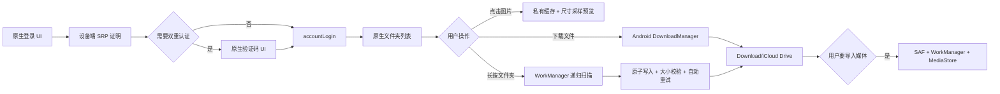

# iCloud 中国区云盘客户端：开发设计文档

> 文档状态：原生 UI / 私有 Web 接口 MVP<br>
> 最后更新：2026-08-21<br>
> 当前版本：0.10.0

## 1. 产品定义

本项目是在 Android 上运行的第三方 iCloud Drive 客户端，服务于中国大陆 Apple 账户。登录、双重认证、文件夹浏览、文件列表和下载按钮全部由 App 的 Jetpack Compose UI 提供；App 不嵌入 WebView，也不依赖浏览器登录状态。

由于 Apple 没有向 Android 第三方 App 提供读取用户整个 iCloud Drive 的公开 API，底层使用 iCloud.com 中国区所调用的未公开 Web 接口。该接口没有稳定性、兼容性或上架许可承诺，必须把它视为可替换的实验性适配层。

### 1.1 MVP 目标

- 仅连接 iCloud 中国区身份、Setup、Drive 和 Document 服务。
- 通过原生表单完成 Apple 账户登录和双重认证。
- 查看整个 iCloud Drive 文件夹树及任意文件类型。
- 显示图片缩略图并在 App 内打开图片预览。
- 提供可持久化的列表/网格布局、图标尺寸和多种排序设置。
- 用户主动下载单个文件，或长按文件夹递归同步到 `Download/iCloud Drive/`。
- 在 App 的“本地”标签页浏览已经下载或同步的文件，图片可显示缩略图并全屏预览；支持搜索、列表/网格和持久化排序。
- 密码不落盘、不明文发送；会话令牌和 Cookie 加密保存。
- 保留照片、视频或 ZIP 到系统相册的可选导入功能。

### 1.2 非目标

- 不提供定时增量扫描、实时同步或双向同步；后台任务只在用户主动发起后运行。
- 不上传、改名、移动或删除云端文件。
- 不支持多账户同时在线。
- 不经过开发者服务器中转账户或文件数据。
- 不尝试绕过 Apple 的双重认证、条款确认、账户锁定或设备授权。
- 不绕过高级数据保护（ADP）；PCS 解密授权必须由用户的受信任设备批准。

## 2. 用户流程



1. App 启动后尝试解密本机会话；存在会话时直接读取根目录。
2. 没有会话时显示 App 自己的账号密码表单。
3. 客户端使用 SRP-6a 生成登录证明，密码不会放进 HTTP 请求体。
4. 如果 Apple 返回双重认证挑战，显示 6 位验证码界面，并支持受信任设备推送和短信。
5. 登录完成后取得 `drivews` 和 `docws` 服务地址，读取根目录。
6. 点击文件夹时读取子项；图片进入视口时按需取得短期下载地址并生成采样预览。
7. 点击图片可全屏预览；单文件下载仍交给系统下载服务。
8. 长按文件夹时创建受网络约束的 WorkManager 前台任务，递归扫描并镜像文件层级。
9. 所有下载和跳转地址都通过 HTTPS 与 Apple 域名白名单检查。
10. 通用文件保留在 Downloads；媒体只有在用户主动选择后才写入 DCIM。

## 3. 技术基线与结构

| 项目 | 决策 |
| --- | --- |
| 语言与 UI | Kotlin、Jetpack Compose、Material 3 |
| 状态管理 | MVVM、Coroutines、StateFlow |
| HTTP | OkHttp，独立 CookieJar |
| JSON | Android `org.json` |
| 认证密码学 | SRP-6a、RFC 5054 2048-bit group、SHA-256、PBKDF2-HMAC-SHA256 |
| 会话加密 | Android Keystore AES-256-GCM |
| 通用下载 | 单文件使用 Android DownloadManager；文件夹使用 WorkManager + MediaStore |
| 图片预览 | App 私有磁盘缓存、BitmapFactory 尺寸采样、内存 LRU |
| 本地文件浏览 | MediaStore Downloads 查询、虚拟目录树、ImageDecoder 目标尺寸解码与 64 MiB 内存缓存 |
| 媒体导入 | SAF、WorkManager、MediaStore |
| 本地数据 | Room、DataStore |
| 注入 | Hilt |
| Android | minSdk 29、compileSdk/targetSdk 36、JDK 17 |

核心目录：

```text
core/icloud/
├── AppleSrp.kt               # SRP 公钥、派生密钥和 M1/M2 证明
├── ICloudApiClient.kt        # 中国区认证、2FA、Drive、Document 请求
├── ICloudCookieJar.kt        # 进程内 Cookie 域匹配与快照
├── ICloudSessionStore.kt     # Keystore 加密会话
├── ICloudDriveRepository.kt  # IO 调度和下载任务
└── ICloudModels.kt

core/sync/
├── FolderSyncCoordinator.kt # 唯一任务、网络约束、退避策略和状态观察
└── ICloudDownloadStore.kt   # Downloads 目录层级、原子写入和完整性校验

core/local/
├── SyncedFileModels.kt      # 本地文件、虚拟文件夹和路径边界
└── SyncedFileRepository.kt  # MediaStore 扫描、图片解码和安全打开

core/settings/
└── LocalBrowserSettings.kt  # 本地布局与排序 DataStore 偏好

core/worker/
└── FolderSyncWorker.kt      # 递归扫描、文件级重试、任务级恢复和通知

feature/main/
├── CloudDriveViewModel.kt    # 登录/2FA/目录/下载/同步状态机
└── CloudDrivePage.kt         # 完全原生 Compose UI

core/web/
└── CloudDriveDownloads.kt    # 仅保留系统下载与文件名/域名校验
```

## 4. 中国区认证协议

### 4.1 固定入口

```text
身份认证：https://idmsa.apple.com.cn/appleauth/auth
主页来源：https://www.icloud.com.cn
账户服务：https://setup.icloud.com.cn/setup/ws/1
```

不自动回退到国际区。`accountLogin` 返回 `domainToUse` 且不是中国区时，应提示账户区域不匹配。

### 4.2 SRP 登录

认证顺序：

1. `GET /authorize/signin` 初始化 Apple 登录会话。
2. `POST /federate` 提交规范化为小写的 Apple 账户名。
3. 生成 32 字节随机私钥 `a`，计算并提交 256 字节填充的 `A = g^a mod N`。
4. `POST /signin/init` 获取 `salt`、`iteration`、`protocol`、`B` 和挑战 `c`。
5. 根据协议派生密码材料：
   - `s2k = PBKDF2(SHA256(password), salt, iteration)`；
   - `s2k_fo = PBKDF2(hex(SHA256(password)), salt, iteration)`。
6. 按 Apple 的 `NoUserNameInX` 变体计算共享密钥和 M1/M2。
7. `POST /signin/complete` 提交证明，不提交密码。

必须拒绝 `B <= 0`、`B >= N`、`u = 0`、未知协议和异常字段长度。任何日志都不得包含账户名、密码、派生密钥、证明、Cookie 或 Apple 会话响应正文。

### 4.3 双重认证

- `409`：需要双重认证。
- `PUT /verify/trusteddevice/securitycode`：主动向受信任设备请求验证码。
- `POST /verify/trusteddevice/securitycode`：验证受信任设备验证码。
- `PUT /verify/phone` 与 `POST /verify/phone/securitycode`：短信发送与验证。
- `GET /2sv/trust`：将本机会话设为受信任。

2026 年起，验证码端点可能在验证成功时仍返回 HTTP 409。只有同一响应同时携带新的 `X-Apple-Session-Token` 才能判定为成功；单独 409 必须判定为验证码错误。

### 4.4 账户会话

完成认证后调用 `/accountLogin`，请求包含 `accountCountryCode`、`dsWebAuthToken`、`extended_login` 和 `trustToken`。只提取 `drivews`、`docws` 和 `pcsRequired` 等必要字段。

保存字段包括会话令牌、信任令牌、会话 ID、认证属性、服务地址和 Cookie。整个 JSON 使用 Android Keystore 中不可导出的 AES 密钥以 GCM 模式加密。Apple 账户与会话一起加密；密码和验证码永不进入会话对象。

### 4.5 高级数据保护与 PCS

当 `drivews.pcsRequired=true` 且会话中没有 `X-APPLE-WEBAUTH-PCS-Documents` 时，不得直接请求 Drive，也不得要求用户关闭高级数据保护。App 进入独立的设备批准状态：

1. 提示用户在 Apple 账户的 iCloud.com 设置中开启“允许访问 iCloud 数据”。
2. `POST /requestPCS`，请求体为 `appName=iclouddrive`、`derivedFromUserAction=true`。
3. 每 10 秒重新请求一次，最多 30 次；等待期间提示用户在受信任 iPhone、iPad 或 Mac 上批准。
4. 只有响应状态为 `success` 且 CookieJar 确实包含 `X-APPLE-WEBAUTH-PCS-Documents` 时才算授权成功。
5. 成功后立即使用 Keystore 加密持久化更新后的 Cookie，再读取云盘根目录。

等待任务必须可取消。进程中止前保存的登录会话允许 App 重启后继续 PCS 授权，但取消登录必须清除令牌和所有 Cookie。

## 5. Drive 浏览和下载

### 5.1 根目录与列表

根目录 ID：

```text
FOLDER::com.apple.CloudDocs::root
```

读取文件夹使用 `drivews/retrieveItemDetailsInFolders`。请求只提交文件夹 `drivewsid`，响应映射为稳定的 UI 模型：ID、名称、类型、大小、修改时间和子项数量。

文件夹类型为 `FOLDER`、`APP_CONTAINER` 或 `APP_LIBRARY`。文件夹始终显示在普通文件之前；每一组可按名称、修改时间、大小或扩展名升序/降序排列。名称和类型使用当前系统语言的 `Collator`，修改时间缺失项始终排在末尾，相同主键再按名称和远端 ID 稳定排序。排序完全在本地完成，不改变云端顺序，也不影响同步清单。UI 维护面包屑路径，Android 返回键逐级返回父目录。

### 5.2 下载票据

从 `drivewsid` 提取 zone 和 document ID，然后调用：

```text
docws/ws/{zone}/download/by_id?document_id={id}
```

优先使用 `data_token.url`，否则使用 `package_token.url`。下载地址必须为 HTTPS，且主机是以下精确域或子域之一：

- `icloud.com.cn`、`icloud-content.com.cn`
- `icloud.com`、`icloud-content.com`
- `apple-cloudkit.com`、`apzones.com`、`cdn-apple.com`
- `apple.com.cn`、`apple.com`

类似 `icloud.com.cn.example.com` 的主机必须拒绝。CookieJar 只向匹配下载 URL 域、路径和 Secure 属性的 Cookie 生成请求头。

### 5.3 保存位置

所有原始文件默认保存到：

```text
Download/iCloud Drive/
```

理由是云盘包含文档、归档和项目文件，不能把所有内容写入 DCIM。单文件下载保持在根目录；文件夹同步保存到 `Download/iCloud Drive/{云端相对路径}/`。文件名移除路径分隔符、控制字符和保留字符，最大长度 180。

文件夹同步写入 MediaStore Downloads 集合并使用 `IS_PENDING=1`：文件完整写入且字节数与 HTTP `Content-Length` 一致后才设置为 0；服务端未给长度时回退到 Drive 元数据大小。中断、取消或校验失败会删除 pending 行，因此半截文件不会作为完成文件出现。App 通过 MediaStore 自动维护的 `OWNER_PACKAGE_NAME` 判断自己写入的行；如果目录中已有其他来源的同名文件，生成稳定的 iCloud 后缀文件名，不覆盖用户文件。

### 5.4 图片缩略图与预览

支持 JPEG、PNG、GIF、WebP、HEIC/HEIF、DNG、BMP、TIFF 和 AVIF 扩展名。文件进入可见区域时才请求下载票据；原始内容临时保存在 App 私有缓存，使用 `BitmapFactory.inSampleSize` 按目标尺寸解码，并按 EXIF 方向旋转。缩略图和全屏预览共用磁盘缓存，内存采用受限 LRU；退出 iCloud 登录时清除预览缓存。

图片预览失败只回退为类型图标，不阻塞目录浏览或文件下载。缓存上限为 384 MiB，超过后按最近使用时间回收到约 288 MiB。

### 5.5 文件夹同步与重试

长按文件夹并确认后创建以远端文件夹 ID 去重的 WorkManager 任务：

1. 在网络可用约束下恢复加密 iCloud 会话。
2. 使用队列递归枚举文件夹，按远端相对路径生成本地目录。
3. 每个目录请求和文件保存最多即时尝试 3 次，延迟为 1、2 秒。
4. 单个文件仍失败时继续处理其余文件，避免一个坏项阻塞整棵目录。
5. 本轮结束后只要存在失败文件，任务返回 `Result.retry()`；WorkManager 使用 30 秒起始的指数退避，最多执行 6 轮。
6. 重试时，已由本 App 写入且大小通过校验的文件直接跳过；所有文件都成功后才报告完整同步。

任务上限为 100,000 个文件，防止异常目录响应耗尽内存。MediaStore 不能单独发布完全空的目录，因此只有包含文件的目录会在公共 Downloads 中出现。当前同步是用户发起的单向下载快照，不删除本地多余文件，也不监控之后的云端变化。

### 5.6 已同步文件浏览与本地图片预览

“本地”标签页查询 MediaStore Downloads 中 `RELATIVE_PATH` 位于 `Download/iCloud Drive/` 的已发布条目，不申请“所有文件访问”权限，也不复制一份文件索引。查询结果按 `RELATIVE_PATH` 还原为只读虚拟目录树；用户在系统文件管理器中移动或删除文件后，刷新即可反映最新状态。

图片类型由 MIME 与扩展名共同识别，通过 `content://` URI 和 `ImageDecoder` 按目标尺寸解码，缩略图与全屏图分别使用不同缓存键，内存缓存上限 64 MiB。云端与本地全屏预览共享缩放组件，支持 1–6 倍双指缩放、边界内拖动、双击在 100%/250% 间切换、比例显示和一键复位。解码错误只显示类型图标或错误提示，不影响其他文件浏览。

本地文件卡片提供可见的“更多”按钮并支持长按菜单。`ACTION_VIEW` 用于选择兼容 App 打开，`ACTION_SEND` 用于分享或发送到聊天、网盘和编辑器；两者均使用 MediaStore `content://` URI、`ClipData` 和临时只读授权，不暴露真实文件路径。设备没有兼容目标或文件已移除时，在 App 内显示明确提示。

本地虚拟目录支持列表/网格切换和当前目录名称搜索。排序字段包括名称、修改时间、大小和文件类型，均支持升序/降序，文件夹始终位于普通文件之前；文件夹时间取全部后代文件的最新修改时间，大小为全部后代文件的安全汇总值。布局与排序写入独立 DataStore，不覆盖云端浏览偏好。目录分组、搜索和排序在 `Dispatchers.Default` 执行，避免大目录阻塞 Compose 主线程。

## 6. UI 状态机

| 状态 | UI |
| --- | --- |
| `RESTORING` | 恢复加密会话进度 |
| `LOGGED_OUT` | 账户、密码、风险确认和登录按钮 |
| `AUTHENTICATING` | 禁用输入并显示进度 |
| `TWO_FACTOR` | 6 位验证码、设备推送、短信和取消 |
| `PCS_APPROVAL` | ADP 说明、受信任设备批准、轮询进度、立即检查和取消 |
| `BROWSING` | 面包屑、列表/网格、排序、缩略图、预览、下载、长按同步和退出 |

网络调用全部在 `Dispatchers.IO`；UI 不持有 Cookie、令牌或 HTTP 响应。密码从 Composable 传给 ViewModel 后立即清空输入状态。下载中的文件 ID 单独记录，避免重复点击创建多个系统任务。布局模式、图标尺寸、排序字段和方向由 DataStore 保存；最近文件夹同步的 Work ID 被保存并重新观察，因此 App 进程重建后仍能显示任务状态。

### 6.1 iOS 风格视觉系统

界面借鉴 iOS Files 和 Settings 的信息层级，但不复制 Apple 专有字体、图标文件或商标素材：

- 浅色模式使用 `#F2F2F7` 分组背景、白色内容面板和 `#007AFF` 主操作色；深色模式使用纯黑背景、`#1C1C1E` 面板和 `#0A84FF` 主操作色。
- 组件统一使用 12/16/22/28 dp 圆角层级，面板采用 0.5 dp 分隔边框和低阴影，不依赖设备动态取色，避免品牌与状态色随壁纸变化。
- 顶部栏使用居中标题，底部标签栏使用无选中胶囊的蓝色矢量图标；文件、文件夹、下载、排序、刷新、安全和状态图标均使用 Apache 2.0 许可的 Compose Material Rounded 矢量路径，不再使用 Emoji。项目只保留实际用到的图标源码，避免完整扩展图标依赖把 APK 体积翻倍。
- 登录、验证码、设备批准、导入、历史和设置使用分组卡片；主要操作使用 52 dp 高蓝色圆角按钮，进度和结果使用带语义颜色的胶囊或提示卡。
- 图片预览继续使用纯黑沉浸式画布和圆形关闭按钮；云盘同时支持列表与网格，缩略图、非图片文件图标和文件夹图标共享同一尺寸设置。
- 文字全部使用 Android 系统无衬线字体并遵循用户字体缩放；浅/深色均由 Material 语义色生成可读前景色，交互图标提供 `contentDescription`。

## 7. 错误模型

| 错误 | 用户提示与处理 |
| --- | --- |
| 网络不可用 | 保留当前页面，允许重试 |
| 账户或密码错误 | 清空会话，返回登录页 |
| 验证码错误或过期 | 留在 2FA 页面，可重发 |
| 401 / 421 | 会话过期，清除并重新登录 |
| 423 / `pcsRequired` | 进入 PCS 设备批准流程；缺少 Documents Cookie 时禁止访问 Drive |
| 429 | 提示稍后重试，不自动高频重放 |
| 5xx | 提示 iCloud 服务暂不可用 |
| 文件传输中断/长度不匹配 | 删除未发布文件，单文件即时重试，随后由 WorkManager 退避重试 |
| 文件夹同步部分失败 | 保留已校验文件，继续其余文件；达到重试上限才报告失败 |
| 本地空间不足/MediaStore 拒绝写入 | 删除 pending 行并自动重试；最终失败时显示未完成状态 |
| JSON/服务地址异常 | 拒绝使用返回值，显示兼容性错误 |
| `domainToUse` 不匹配 | 提示必须使用中国大陆 iCloud 账户 |

异常消息不得拼接 Apple 原始响应正文，防止服务端返回的个人信息或令牌进入日志/UI。

## 8. 可选媒体导入

云盘下载与相册导入是两个独立流程。用户通过 SAF 主动选择下载后的图片、视频或 ZIP，WorkManager 才执行：

1. 把输入流式暂存到 App 私有缓存并检查空间。
2. ZIP 拒绝绝对路径、`..` 路径逃逸、加密包和超过 5,000 个条目的归档。
3. 结合文件签名、MIME 和扩展名识别 JPEG、HEIC/HEIF、PNG、GIF、DNG/RAW、MP4、MOV。
4. 计算 `SHA-256 + 字节数`，跳过精确重复。
5. 使用 `IS_PENDING=1` 原子写入 `DCIM/iCloud Photos/`，成功后发布。
6. Room 保存批次、文件级状态和错误码；任务可取消并可从检查点恢复。

通用 PDF、Office、压缩包等不得进入 MediaStore 图片/视频集合。

## 9. 安全与隐私

- 仅声明网络、用户发起任务通知和必要前台服务权限，不申请“所有文件访问”或全相册读取权限。
- Manifest 禁止明文 HTTP，App 备份关闭，会话不进入云备份。
- 服务发现结果必须重新执行 HTTPS 和域名白名单校验。
- OkHttp 不安装网络日志拦截器；崩溃报告不得记录请求头、请求体或响应正文。
- 退出登录清除内存 CookieJar、加密偏好和私有图片预览缓存；已下载文件不删除。
- 不使用证书校验绕过、自签名信任或宽松 HostnameVerifier。
- UI 明示私有接口风险、第三方身份和数据只在本机处理。

## 10. 测试策略

### 10.1 自动化测试

- SRP `s2k`、`s2k_fo` 独立 PBKDF2 向量。
- 固定私钥、固定 B 的 M1/M2 独立证明向量。
- 拒绝非法 SRP B 和未知协议。
- 下载域名精确后缀校验和相似域名绕过。
- 文件名清理、长度和同名策略。
- 云端图片扩展名识别、布局尺寸边界、四种排序及方向、文件夹优先和同步目录清理。
- MediaStore 相对路径边界、本地虚拟目录分组、无 MIME 图片扩展名识别、四种排序、搜索过滤和图片平移边界。
- 原有 ZIP 路径、媒体识别、哈希与设置测试。
- Debug 单元测试、Lint 和 APK 构建。

### 10.2 真机集成测试

自动化环境不能携带真实 Apple 凭据。发布前必须使用测试专用中国大陆账户，在至少 Android 10、13、15/16 和三星/小米/OPPO/vivo 设备覆盖：

- 首次登录、错误密码、账户锁定提示。
- 受信任设备验证码、错误码、过期码、重发和短信。
- 进程被杀后恢复加密会话、会话到期后重登。
- 根目录、深层目录、空目录、中文/Emoji/超长文件名。
- PDF、Office、ZIP、图片、视频和 iWork package 下载。
- 缩略图、全屏预览、列表/网格切换、四种升降序排序和 48–144 dp 图标尺寸持久化。
- 已同步文件目录还原、本地图片缩略图/全屏缩放预览、搜索、双布局、四种双向排序、打开方式、分享、外部删除后刷新及非图片文件打开。
- 长按文件夹同步、深层路径保留、重复任务去重、进程被杀后恢复和取消。
- Wi-Fi/蜂窝网络切换、断网、空间不足、传输截断、自动重试和重复点击。
- 中国区条款未确认、iCloud Drive 未开启、ADP 批准成功/拒绝/超时和关闭网页访问。

测试账户不得包含真实个人照片、联系人、位置或生产文件；凭据不得写入仓库、Gradle 属性、CI Secret 输出或截图。

## 11. MVP 验收标准

- App 中不存在 WebView，所有登录与文件 UI 都是原生 Compose。
- 中国大陆测试账户可完成 SRP 登录、2FA 和根目录读取。
- ADP 测试账户可在不关闭高级数据保护的情况下，通过受信任设备批准后读取根目录。
- 可逐层浏览文件夹，图片显示缩略图并可在 App 内预览。
- 可切换列表/网格、调整图标大小并选择名称/时间/大小/类型排序；设置在 App 重启后保留。
- 可下载至少文档、压缩包、照片和视频；长按文件夹可保留层级递归同步。
- 原始文件出现在 `Download/iCloud Drive/`，每项完整写入且字节数校验通过；失败项自动重试并不会被误报为完成。
- “本地”标签页可逐层浏览已同步文件，搜索并按名称/时间/大小/类型排序，切换列表/网格；图片可缩放和拖动预览，任意本地文件可用临时只读 URI 交给其他 App 打开或分享。
- 密码/验证码不落盘；重启后仅通过 Keystore 加密会话恢复。
- 非 HTTPS、白名单外域名和相似域名下载均被拒绝。
- 退出登录后不能继续读取云盘，已下载文件保留。
- 单元测试、Lint、Debug 构建通过；真机测试结果记录在发布清单。

## 12. 兼容与发布说明

私有接口适配层需要独立版本管理。发现 Apple 改动时优先更新请求头、状态码兼容和 JSON 映射，不让协议字段泄漏到 UI。若维护成本或账户风险不可接受，应停用登录入口并提示升级，而不是回退到明文密码认证。

应用商店文案不得声称“Apple 官方”“永久兼容”或“实时同步”。隐私政策必须说明 App 接收用户输入的 Apple 账户和密码用于设备端 SRP、会加密保存会话、使用私有 Web 接口，以及开发者服务器不接收这些数据。

## 13. 参考

- [Apple：在 iCloud.com 上查看和下载 iCloud Drive 文件](https://support.apple.com/guide/icloud/view-and-download-files-mmbdb4c6b10f/icloud)
- [Android：DownloadManager](https://developer.android.com/reference/android/app/DownloadManager)
- [Android：Keystore](https://developer.android.com/privacy-and-security/keystore)
- [Android：Storage Access Framework](https://developer.android.com/training/data-storage/shared/documents-files)
- [Android：MediaStore](https://developer.android.com/training/data-storage/shared/media)
- [Android：WorkManager 长时间运行的 Worker](https://developer.android.com/develop/background-work/background-tasks/persistent/how-to/long-running)
- [rclone：iCloud Drive backend](https://github.com/rclone/rclone/tree/master/backend/iclouddrive)
- [pyicloud：China domain endpoint implementation](https://github.com/picklepete/pyicloud)

协议实现参考 rclone 的 MIT 许可代码并重新以 Kotlin 编写，详见仓库根目录 `NOTICE`。
